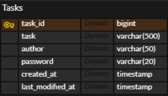

# API 명세
| 기능    | URI               | HTTP 메소드 | 요청                                                                                                               | 응답                                                                                                                                                                              |
|-------|-------------------|----------|------------------------------------------------------------------------------------------------------------------|---------------------------------------------------------------------------------------------------------------------------------------------------------------------------------|
| 일정 생성 | `/tasks`          | POST     | 요청 본문:<br>```json<br>{ "task": "My Task", "author": "Username", "password": "password" }<br>```                  | `201`: 정상 등록<br>`400`: 필드 누락 또는 필드값 누락                                                                                                                                          |
| 전체 조회 | `/tasks`          | GET      | 없음                                                                                                               | `200`: 정상 조회<br>```json<br>[ { "taskId": "1", "task": "task1", "author": "author1", "createdAt": "yyyy-mm-dd hh:mm:ss", "lastModifiedAt": "yyyy-mm-dd hh:mm:ss" }, ... ]<br>``` |
| 단건 조회 | `/tasks/{taskId}` | GET      | 경로 매개변수                                                                                                          | `200`: 정상 조회<br>```json<br>{ "taskId": "1", "task": "task1", "author": "author1", "createdAt": "yyyy-mm-dd hh:mm:ss", "lastModifiedAt": "yyyy-mm-dd hh:mm:ss" }<br>```          |
| 단건 수정 | `/tasks/{taskId}` | PATCH    | 경로 매개변수 + 요청 본문:<br>```json<br>{ "task": "other task", "author": "other author", "password": "password" }<br>``` | `200`: 정상 수정<br>`400`: 아무 필드도 없거나 잘못된 필드 존재<br>`403`: 비밀번호 불일치                                                                                                                  |
| 단건 삭제 | `/tasks/{taskId}` | DELETE   | 경로 매개변수 + 요청 본문:<br>```json<br>{ "password": "password" }<br>```                                                 | `200`: 정상 삭제<br>`403`: 비밀번호 불일치                                                                                                                                                 |


# ERD
